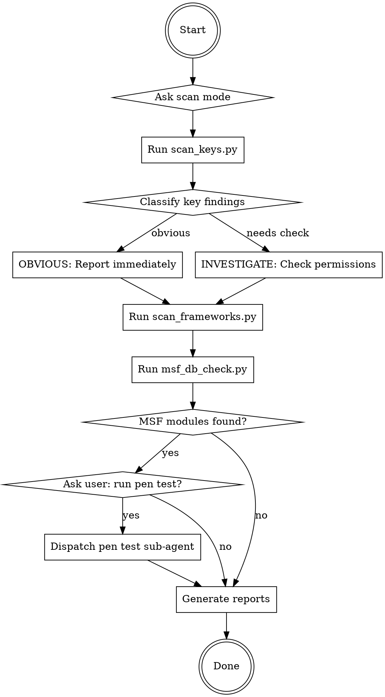

# Security Audit

Red team security auditor that scans source code and build artifacts for exposed secrets, vulnerable dependencies, and exploitable CVEs. Generates actionable reports in both Markdown (for automated fixing) and HTML (for human review).

## Scan Modes

Ask the user which mode to run. Default to **changes only** if invoked from pre-commit context.

| Mode | What it scans | When to use |
|------|--------------|-------------|
| **Full scan** | Entire project directory + build artifacts (dist/build/out) | First audit, periodic review, before deployment |
| **Changes only** | Only git staged/changed files | Pre-commit hook, quick check during development |

## Workflow



## Phase 1: Secret Scanning

Run the key scanner on the target:

```bash
# Full scan
python3 ~/.claude/skills/security-audit/scripts/scan_keys.py <project_dir> -o /tmp/key-scan-results.json

# Changes only (pass staged files)
python3 ~/.claude/skills/security-audit/scripts/scan_keys.py <project_dir> --changed-files <file1> <file2> ... -o /tmp/key-scan-results.json
```

**Do NOT scan `.env` files.** They are excluded by default.

Parse the JSON output. For each finding:

- **OBVIOUS classification**: Report immediately with severity from the scan. No further investigation needed. These are secrets that must never appear in source or build artifacts.
- **INVESTIGATE classification**: Use curl to check the key's actual permissions before assigning severity. See `references/key_patterns.md` for investigation procedures per key type.

When investigating a key with curl, follow the procedure for that specific key type. For example, for a Supabase anon key, decode the JWT and test RLS policies. For a Stripe publishable key, verify no secret key is co-located.

## Phase 2: Dependency Vulnerability Scan

Run the framework scanner, then cross-reference against vulnerability databases:

```bash
# Extract dependency versions
python3 ~/.claude/skills/security-audit/scripts/scan_frameworks.py <project_dir> -o /tmp/deps-results.json

# Check against OSV.dev + Metasploit DB
python3 ~/.claude/skills/security-audit/scripts/msf_db_check.py /tmp/deps-results.json -o /tmp/vuln-results.json
```

The vulnerability checker queries OSV.dev (free, no API key) for known CVEs, then checks if Metasploit has exploit modules for any matches.

## Phase 3: Pen Testing (User-Initiated Only)

If `msf_db_check.py` finds vulnerabilities with Metasploit modules, present the findings to the user and ask:

> "I found [N] vulnerabilities with known Metasploit exploit modules. Do you want me to run active pen testing against a target? This requires msfconsole and a target URL/IP."

**Only proceed if the user explicitly confirms and provides a target.**

When confirmed, dispatch a sub-agent with this prompt:

```
You are a penetration testing specialist conducting an authorized security assessment.

TARGET: [user-provided target]
VULNERABILITY: [CVE ID] in [dependency]@[version]
METASPLOIT MODULE: [module_path from msf_db_check results]

AUTHORIZATION CONTEXT: This is an authorized pen test requested by the project owner on their own infrastructure.

PROCEDURE:
1. Verify the target is reachable with curl
2. Launch msfconsole and load the module: use [module_path]
3. Set RHOSTS to [target]
4. Run "check" first to verify vulnerability without exploitation
5. Report the check result with CVSS severity

OUTPUT FORMAT:
- Vulnerability confirmed/not confirmed
- CVSS score and vector
- Evidence from the check command
- Recommended remediation
- Do NOT run "exploit" - only use "check" for verification

IMPORTANT: Only run the "check" command. Do NOT attempt active exploitation.
```

## Phase 4: Report Generation

After all scans complete, generate both reports:

```bash
python3 ~/.claude/skills/security-audit/scripts/generate_report.py \
  --keys-result /tmp/key-scan-results.json \
  --vuln-result /tmp/vuln-results.json \
  --output-dir <project_dir> \
  --project "<project_name>"
```

This creates a timestamped directory under `docs/audit/`:
- `docs/audit/{timestamp}/security-audit-report.md` - Structured for an agent to parse and auto-fix issues
- `docs/audit/{timestamp}/security-audit-report.html` - Visual report for the user to review in browser

Present the summary to the user with critical/high counts and the report file paths.

## Pre-Commit Hook Setup

To install the automatic pre-commit scanner:

```bash
bash ~/.claude/skills/security-audit/scripts/setup_hook.sh
```

The hook scans only staged files for exposed secrets and blocks the commit if any OBVIOUS findings are detected. It does NOT run the full dependency vulnerability scan (that would be too slow for a pre-commit hook).

## Severity Ratings

Follow CVSS v3.1 scoring. See `references/cvss_guide.md` for the full mapping.

| Severity | CVSS | Meaning |
|----------|------|---------|
| Critical | 9.0-10.0 | Fix immediately. Actively exploitable, no special setup. |
| High | 7.0-8.9 | Fix before release. Exploitable but requires conditions. |
| Medium | 4.0-6.9 | Plan fix. Requires significant setup or limited impact. |
| Low | 0.1-3.9 | Track. Theoretical risk, difficult to exploit. |

## Resources

- `scripts/scan_keys.py` - API key and secret scanner with pattern matching
- `scripts/scan_frameworks.py` - Dependency version extractor (npm, pip, go, ruby, php)
- `scripts/msf_db_check.py` - Cross-references deps against OSV.dev and Metasploit DB
- `scripts/generate_report.py` - Generates MD + HTML reports
- `scripts/setup_hook.sh` - Installs git pre-commit hook
- `references/key_patterns.md` - All key regex patterns with classification and investigation procedures
- `references/cvss_guide.md` - CVSS severity mapping and per-finding report format
- `assets/report_template.html` - Styled HTML report template
